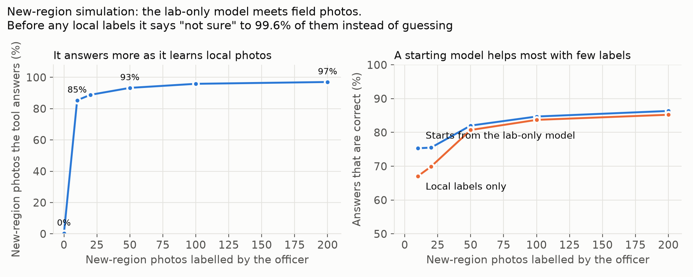

<!--
Generated from docs/templates/README.tmpl.md by ml/fill_docs.py (numbers come from results/numbers.json).
Left for the team to fill: {{VIDEO_URL}}. Delete this comment after filling.
-->

# Kahawa Check

**An offline coffee-leaf check for cooperative relay farmers in central Kenya. It says "not sure" when it should, and the extension officer makes the final call.**

*Kahawa* is Swahili for coffee. "Kahawa Check" is a working name.

Live app: https://git-lsd.github.io/kahawa-check/ · Code: https://github.com/git-lsd/kahawa-check · Video: {{VIDEO_URL}}

Built for the World Bank / Hack-Nation "Small AI for Development" hackathon, Agriculture sector, 3–4 October 2026.

---

## What it is

Kahawa Check is a phone web app for the cooperative's relay farmer: a volunteer farmer who visits other members' plots. On a plot visit, the relay farmer photographs the underside of 3 leaves on each of 5 coffee trees. A small image model on the phone checks each photo for leaf rust, leaf miner, brown eye spot (Cercospora) and Phoma, or says **"not sure — the officer will look"**. The 15 results become a plot card, read out in Swahili. A six-question checklist (marked "not AI") covers yield causes a leaf photo cannot show. Photos the model is unsure about wait in a queue for the extension officer. When the officer labels them, the model is updated on the phone, and the update can be shared with other relay farmers as a small file. A co-op screen ranks villages by rust signal, adjusted for small numbers of photos, so the officer's few visits go where they are most needed. Everything runs on the phone, without internet, after the first visit.

## Who uses it, and when

| Person | When | What they do with it |
|---|---|---|
| **Relay farmer** (cooperative volunteer, own smartphone) | During a plot visit, about 15 minutes per plot (our estimate; not timed on a farm) | Asks consent, takes 15 leaf photos, reads or plays the plot card to the farmer, asks the checklist, saves |
| **Noor** (smallholder, basic phone) | During the visit, on her own plot | Hears the result in Swahili (a few phrases in Kikuyu). Her own phone is not needed. |
| **Extension officer / cooperative agronomist** | On a visit to the area (the brief's scenario says about twice a year) | Reviews the "not sure" queue and a 1-in-10 spot check, labels photos, presses "Update the model on this phone", shares the update |
| **Cooperative office** | When planning the officer's visits | Looks at the village ranking; exports a CSV of village totals |

Why the relay farmer and not Noor: only 27.5% of rural Kenyan women aged 15–49 own a smartphone (Kenya DHS 2022). Noor's phone stays at the house while she works. The cooperative already exists (cooperatives market 70% of Kenya's coffee), and the World Bank-funded NAVCDP project already uses 3,248 "digitally equipped agripreneurs" for last-mile advice. Sources: [docs/PROBLEM_EVIDENCE.md](docs/PROBLEM_EVIDENCE.md).

## How it works

```
 Plot visit (relay farmer's phone, offline)
 ------------------------------------------
 consent --> village + member number (saved only as a scrambled code)
    |
    v
 leaf photo --> photo quality check (too dark, too bright, no detail -> "take again")
    |
    v
 frozen image model (MobileNetV3, 16.8 MB) --> 1,280 numbers per photo
    |
    +--> small head (68 KB) --> best guess among 5 classes + confidence
    |
    +--> familiarity check: compare with 1,000 stored training photos (1284 KB)
    |
    v
 Gate: confidence below the line, OR photo unlike anything the model learned from?
    |                                   |
   yes                                  no
    |                                   |
    v                                   v
 "Not sure - the officer will look"   answer from a FIXED list (English / Swahili / Kikuyu tier)
 photo goes to the officer queue      "The extension officer makes the final call."
                                      (1 in 10 answers also go to the queue as a spot check)
    |
    v
 15 photos --> plot card  +  6-question checklist (not AI)  -->  saved on the phone

 Officer visit (same phone, offline)
 -----------------------------------
 officer labels queued photos --> small head refit on the phone, pulled toward the shipped model
                              --> labelled photos join the "familiar" set
                              --> update file (about 0.3 MB for 50 labels) shared by WhatsApp / Bluetooth / memory card

 Co-op screen (offline)
 ----------------------
 rust share per village, shrunk toward the regional rate (Beta-binomial, empirical Bayes)
 --> ranked list of villages for the officer's next visits
```

## The Small-AI rules and how we meet them

| Rule from the brief | How Kahawa Check meets it | Limit, stated |
|---|---|---|
| Runs on a device the user already has | The relay farmer's own smartphone, in the browser (iPhone or Android). No app store, no account, no server. | Tested in a desktop browser at phone size (375 × 812) and in headless Chrome. Not yet tested on a real phone or on iPhone Safari. Noor's basic phone is not used; she is reached through a person. |
| Core feature works offline | After the first visit, a service worker keeps every file on the phone. Photo check, plot card, checklist, officer review, model update and co-op screen all work in airplane mode. | Tested with Chrome's offline mode in a test browser, including under a sub-path as on GitHub Pages. A test on a real phone in airplane mode is still to do. |
| Model files small enough to side-load or send over a weak connection | Image model 16.8 MB; head 68 KB; familiarity set 1284 KB. An officer's update is a file of about 0.3 MB for 50 labels (about 13 KB for the head plus about 1.3 KB per labelled photo in binary form; the app writes it as text, which is larger). | The first visit downloads about 35 MB once (model, runtime, Swahili audio), best done on cooperative Wi-Fi. A web app cannot be copied phone-to-phone like an Android install file. The image model is not quantised (32-bit numbers). |
| At least one interaction in a named local language | **Swahili**: all 24 fixed answers as text and audio. **Kikuyu** (Gĩkũyũ), the less-supported tier: 3 answers start with a Kikuyu phrase, the rest falls back to Swahili, and the app says so. | No native speaker has checked the text yet. Every local-language string is marked "not yet checked" on screen. See [docs/LANGUAGE.md](docs/LANGUAGE.md). |
| A person makes the final call; flag what it is unsure of | Two "not sure" gates; officer queue; spot check; "Different problem (not in list)" label for the officer; every disease answer ends with "The extension officer makes the final call"; no spray names or doses; nothing is sent automatically. | The officer visits rarely, so a "not sure" photo can wait a long time. The "not sure" answer says "Do not spray because of this result". |
| Avoid hallucinations | The tool never writes text. Every sentence comes from a fixed list of 24 answers in `answers.json`. | The tool cannot answer free questions. Those go to the officer. |

## What the AI does, and why a simpler tool would not do the same job

- **Computer vision.** It reads a leaf photo and recognises disease patterns. SMS cannot carry or read a photo. A spreadsheet cannot look at a leaf. A web search needs signal and returns general pictures, not an answer about this leaf.
- **Knowing when it does not know.** The familiarity check compares each photo with stored training photos. This is the part that matters most in the field (see Evaluation).
- **Learning from local labels on the phone.** The officer's labels refit the last layer of the model on the phone. No server and no data scientist are needed.
- **What is not AI, and is labelled so.** The six-question checklist is fixed questions. The village ranking is plain statistics (a Beta-binomial model). The plot card rule is a fixed rule.

## Data

All four image datasets are open under **CC BY 4.0**. None was collected by us. Full details, including what each dataset does not cover: [docs/DATA_CARD.md](docs/DATA_CARD.md).

| Role | Dataset | Notes |
|---|---|---|
| Train | JMuBEN + JMuBEN2 (Kenya, Kirinyaga, arabica) | Cropped close-ups with many rotated copies; up to 1,500 per class after removing copies |
| Train (half) and calibrate (other half) | BRACOL (Brazil, arabica) | Picked leaves on a white background; our download was damaged, 1,342 of 1,747 leaf images usable |
| Sealed field test | RoCoLe (Ecuador, robusta) | Leaves on the plant, one smartphone, real light. Healthy vs rust; red spider mite photos as an "unknown pest" test |
| Demo photos | 7 RoCoLe photos in `samples/` | Part of the field test set; not used in the demo update |

Training uses 7045 photos. Calibration uses 672. The field test has 1385 healthy and rust photos and 167 red spider mite photos.

**What the data does not cover.** No photo comes from a Kenyan farm taken the way the tool will be used. The Kenyan photos are lab-style crops; the field photos are from Ecuador and a different coffee species. Only five leaf classes. No berries (so no coffee berry disease or berry borer: the checklist covers these). No relay farmers' phones.

## Evaluation

Full results: [results/RESULTS.md](results/RESULTS.md). Figures: `results/figs/`.

**1. Lab accuracy does not carry over to the field, and the model does not know it.**

| Test | Result |
|---|---|
| Held-out lab-style photos (BRACOL, 672), forced to answer every photo | 84% right |
| Field photos (RoCoLe, 1385), forced to answer every photo | 2.5% right, with 93% average confidence |
| Spotting field photos as unfamiliar: familiarity check vs model confidence (AUROC; 0.5 = chance) | 0.999 vs 0.29 |
| Field photos, with both "not sure" gates on | "not sure" to 99.6% |
| Unknown pest (red spider mite, 167) | "not sure" to 100% |

Out of the box, the tool is mainly a structured way to send photos to the officer. That is intended: a confident wrong answer would be worse.

**2. Officer labels make the model local.** The head is refit with the officer's labels, pulled toward the lab model. Labels here come from the RoCoLe authors, standing in for an officer.

| Officer labels | Photos answered | Answers correct | Answers correct, local labels only (no lab model) |
|---|---|---|---|
| 0 | almost none ("not sure" to 99.6%) | – | – |
| 10 | 61% | 74% | 63% |
| 50 | 91% | 82% | 80% |
| 200 | 96% | 86% | 85% |



**3. Co-op early warning (simulation with synthetic villages).** Per round of 40 villages with about 6.5 real outbreaks: raw shares raise 8.1 false alarms and miss 1.2 outbreaks; adjusted shares raise 4.7 false alarms and miss 2.0. If the officer can visit 5 villages, the adjusted ranking finds 3.3 real outbreaks against 3.0 for raw shares. The adjustment trades fewer false alarms for more misses. Simplification: the villages are synthetic; only the model's error rates are measured. The app and the simulation use the same rule: alert when the chance that a village's share of answered photos flagged as rust is above 25% is more than 0.5. Because the share includes the tool's own false positives (healthy leaves flagged as rust), healthy villages sit close to the line, which is why raw shares give many false alarms.

**4. Size vs accuracy.** A 5 times larger image model (DINOv2-small, 21.6M parameters, about 87 MB) is right 49% of the time on field photos with no local labels. After 50 labels it answers 58% of photos, 90% of them correctly. We ship the small model to respect the side-loading rule and rely on local labels instead.

**5. A limit we found.** After 50 local labels, the tool says "not sure" to far fewer red spider mite photos (a pest it was never taught), and calls some of them healthy. That is why the app keeps a 1-in-10 spot check and a "Different problem (not in list)" label for the officer.

**Speed.** About 4 ms per photo on a laptop CPU. The app shows the time on the phone under "Details" after each photo; we have not yet recorded it on a phone.

**The phone matches the Python pipeline.** The ONNX model gives the same class as the Python evaluation on 25 of 25 test photos (largest difference in the photo summary: 0.0001). In the browser, the app's photo summary matched Python to 4 decimals on the samples compared, with the same answer and the same familiarity distance.

## Responsible AI

Summary below. The full account (privacy, consent, deletion, Kenya Data Protection Act, bias, failure modes): [docs/RESPONSIBLE_AI.md](docs/RESPONSIBLE_AI.md).

- **Fail-safe:** "not sure — the officer will look" whenever the model is unsure or the photo is unfamiliar.
- **Human oversight:** the officer makes the final call. Only officer labels change the model. A penalty keeps updates close to the shipped model. An update loads only on the model version it was made for.
- **No advice that can hurt:** no pesticide names, no doses, no prices. Fixed answers only.
- **Privacy:** no names, phone numbers or locations. The member number is saved only as a SHA-256 code (short numbers can still be guessed by someone with the phone). Photos are kept as 160-pixel thumbnails. Data stays on the phone until a person exports it. The co-op export holds village totals only. The model update file holds no photos, villages or member codes.
- **Consent:** asked aloud at the start of every visit. The visit cannot start without it.
- **Deletion:** "Delete all data on this phone" in the About screen.
- **Known gaps:** no per-farm delete button, no app PIN, no native-speaker check yet.

## Languages

English on screen. Swahili for the 24 fixed answers, as text and audio. Kikuyu as the less-supported tier. Details, resource comparison and the native-speaker review plan: [docs/LANGUAGE.md](docs/LANGUAGE.md).

| | Swahili | Kikuyu |
|---|---|---|
| Common Voice speech hours | 417 validated | 0 (not open for recording) |
| Machine translation from English (NLLB-600M, chrF++) | 58.0 | 34.9 |
| Text-to-speech voice | Meta MMS | Meta MMS |
| In the app | All 24 answers, text and audio | 3 answers start with a Kikuyu phrase; the rest is Swahili, marked as fallback |

No one on the team speaks Swahili or Kikuyu. So the tool uses a fixed list a speaker can check in about 30 minutes, and every local-language string is marked unverified until then. Without a speaker, we cross-checked every phrase four ways (two translation models, a blind back-translation by a separate AI agent, and key terms against published Swahili farm material) and rewrote 10 weak phrases ([docs/SWAHILI_CHECK.md](docs/SWAHILI_CHECK.md)). Under every spoken answer, a **"Wording wrong?"** button lets the relay farmer or officer report a better phrasing; reports are saved on the phone, travel with the officer's update or as a CSV, and never change the app's text until someone reviews them. On the English screen, the play button plays the Swahili audio (tagged "Audio in Swahili").

## Run it

**On a phone (GitHub Pages).** Open https://git-lsd.github.io/kahawa-check/ once with internet. The chip at the top right shows "Saving for offline", then "Model ready". From then on it works in airplane mode. Use "Add to Home Screen" from the browser menu so it opens like an app (on iPhone this also stops Safari from clearing its data after 7 days without use).

**Locally.** The app is plain HTML, CSS and JavaScript, with no build step. It needs a local web server, because browsers block the model and the offline cache on `file://` pages.

```bash
cd kahawa-check
python3 -m http.server 8000
# open http://localhost:8000 in Chrome, at phone width (DevTools device toolbar)
```

To try it: Plot visit → "Farmer agrees" → type any village → "Try sample photos". Out of the box the model says "not sure" to these field photos. Then Officer → "Load demo update (50 labels, demo only)" and try the samples again. Co-op → "Load demo villages (synthetic)" shows the ranking.

Note: offline mode on a phone needs HTTPS. A phone opening `http://<laptop-ip>:8000` on the same Wi-Fi can test the screens, but not offline mode. Use the GitHub Pages address for that.

**Publish on GitHub Pages.** Upload the contents of this folder to a public repository. Then Settings → Pages → "Deploy from a branch" → `main`, `/ (root)` → Save. After a minute or two the app is at `https://<user>.github.io/<repo>/`. Add an empty file called `.nojekyll` at the top level so GitHub serves every file as it is. **On every new deploy, change `VERSION` in `sw.js`**, or phones keep the old model and audio.

**Rebuild the model** (optional; needs the raw datasets, about 2.7 GB, in `../data_raw/`; download links in [docs/DATA_CARD.md](docs/DATA_CARD.md)). With a Python environment that has PyTorch, timm, onnxruntime, scikit-learn, scipy and Pillow:

```bash
python ml/prepare_embed.py      # index datasets, remove augmented copies, embed photos
python ml/train_eval.py         # train head, calibrate, field test, learning loop, village simulation
python ml/check_onnx.py         # check the phone's model gives the same answers as Python
python ml/make_figures.py       # figures in results/figs/
python ml/write_results_md.py   # results/RESULTS.md and results/numbers.json
```

The Swahili and Kikuyu texts and audio are rebuilt with the scripts in `audio/tools/` (see [docs/LANGUAGE.md](docs/LANGUAGE.md), section 8).

## What is in this repository

| Path | What it is |
|---|---|
| `index.html`, `app.js`, `styles.css` | The app (no framework, no build step) |
| `sw.js`, `manifest.webmanifest`, `icons/` | Offline cache and "Add to Home Screen" |
| `lib/kahawa-core.js` | Shared maths: familiarity check, on-phone refit, Beta-binomial prior |
| `vendor/ort/` | onnxruntime-web 1.30.0 (WebAssembly build) and its licence |
| `model/` | Image model (ONNX), small head, familiarity set, demo update |
| `answers.json`, `audio/` | The fixed answer list (English, Swahili, Kikuyu tier) and audio |
| `samples/` | 7 RoCoLe field photos for the demo |
| `ml/` | Training and evaluation scripts |
| `results/` | Metrics, figures, RESULTS.md |
| `docs/` | Data card, Responsible AI, languages, problem evidence, video scripts |

## Licences and attributions

| Item | Licence | Credit |
|---|---|---|
| JMuBEN, JMuBEN2 | CC BY 4.0 | Jepkoech, Mugo, Kenduiywo, Chebet (2021); University of Embu, JKUAT, Chuka University. *Data in Brief* 36, 107142 |
| BRACOL | CC BY 4.0 | Krohling, Esgario, Ventura (2019); Universidade Federal do Espírito Santo |
| RoCoLe (including the 7 photos in `samples/`) | CC BY 4.0 | Parraga-Alava, Cusme, Loor, Santander (2019). *Data in Brief* 25, 104414 |
| MobileNetV3-Large weights (timm `mobilenetv3_large_100`) | Apache-2.0 | Ross Wightman, PyTorch Image Models. Pretrained on ImageNet-1k, whose images have their own non-commercial terms; we use the released weights and share no ImageNet images. |
| onnxruntime-web 1.30.0 | MIT | Microsoft. Licence in `vendor/ort/LICENSE.txt` |
| Swahili and Kikuyu audio (made with Meta MMS TTS, `facebook/mms-tts-swh`, `facebook/mms-tts-kik`) | CC-BY-NC 4.0 | Meta AI. Non-commercial: fine for this hackathon and a non-commercial pilot. A paid service would need recorded human clips. |
| NLLB-200 and MMS-1b-all (used on a laptop to check text and audio; not shipped) | CC-BY-NC 4.0 | Meta AI |
| Advice text in `answers.json` | – | Written from Kenyan extension material, mainly the Kenya Coffee Sustainability Manual (review led by KALRO Coffee Research Institute), Infonet-Biovision and CABI Plantwise. Sources per answer in `answers.json`. |
| Our code and documents | MIT (see LICENSE) | The team |

## Limitations

- **No Kenyan field photos.** The field test is Ecuadorian robusta. Real accuracy on Kenyan farms is unknown until an officer labels photos from relay farmers' phones there.
- **Out of the box it mostly says "not sure".** It becomes useful only after the officer labels local photos. If the officer never comes, the queue only grows.
- **The learning-loop gain is likely too optimistic.** Labelled photos and test photos come from the same field in Ecuador, and labels come from the dataset authors, not an officer.
- **Unknown problems after adaptation.** Once field photos look familiar, the familiarity check catches unknown pests less often. The spot check sees only 1 in 10 answers.
- **Five leaf classes only.** No bacterial blight, Fusarium, nutrient shortage or other pests. No berries.
- **Unverified Swahili and Kikuyu.** Back-translation flagged 10 of 24 Swahili answers for a speaker to check.
- **Phones.** Not yet tested on a real phone or on iPhone Safari. Phone speed not yet measured. First download is about 35 MB.
- **Privacy on a shared phone.** No app PIN, no per-farm delete, no remote wipe. Short member numbers can be guessed from their codes.
- **The co-op ranking assumes** photos are independent and the model's answers are correct.
- **The village simulation uses synthetic villages.**
- **Price is out of scope.** The brief also mentions price information; this tool stays on one decision: what is affecting the leaves, and who should look next.

## Team

- **Sidian Lin**, PhD in Public Policy (Harvard GSAS and HKS). Works on operations research and machine learning for public services. Co-wrote a report on Zimbabwe's Friendship Bench (task-sharing in community mental health), and wrote a paper on steering patients to hospitals when hospital quality is estimated from few cases.
- **Yicong Li**, PhD student in Computer Science (Harvard), working on computer vision.

Built with an AI coding assistant (Claude Code). The team directed the design and is responsible for what is submitted.
