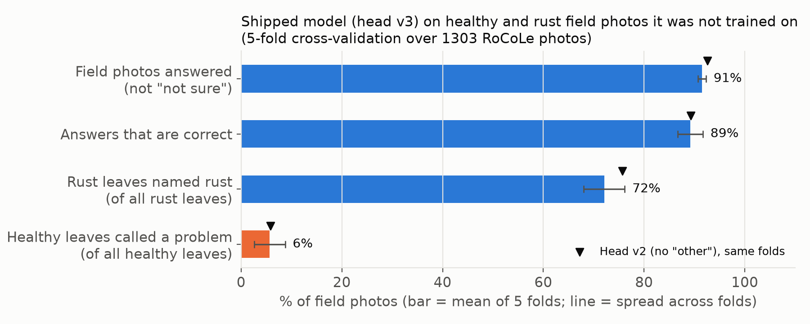
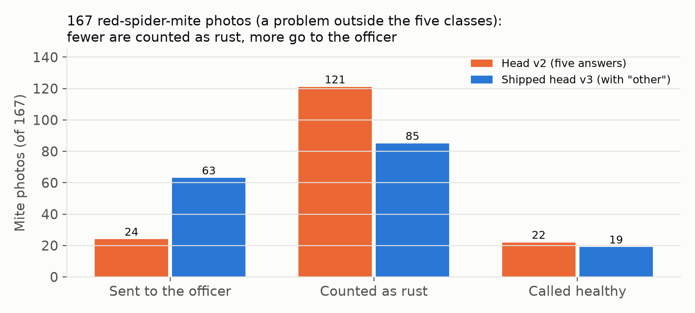
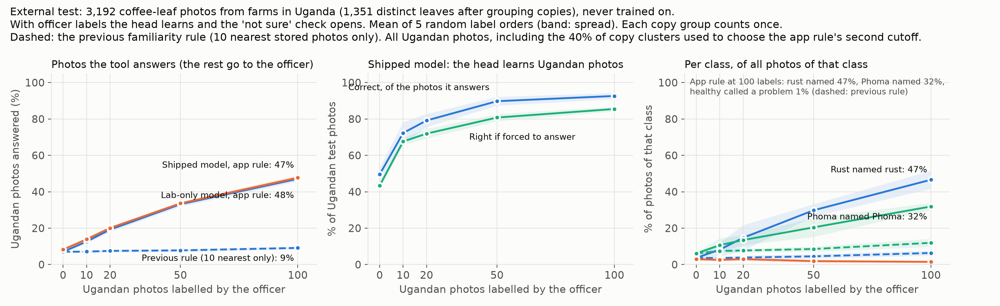
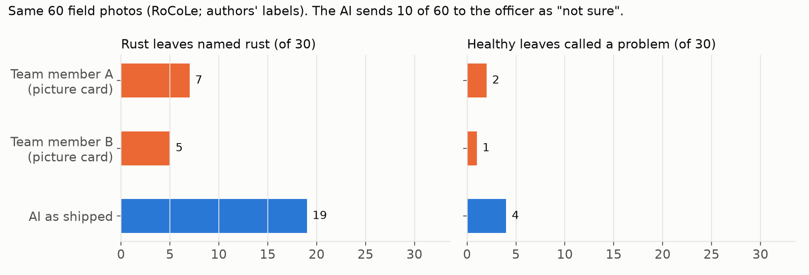
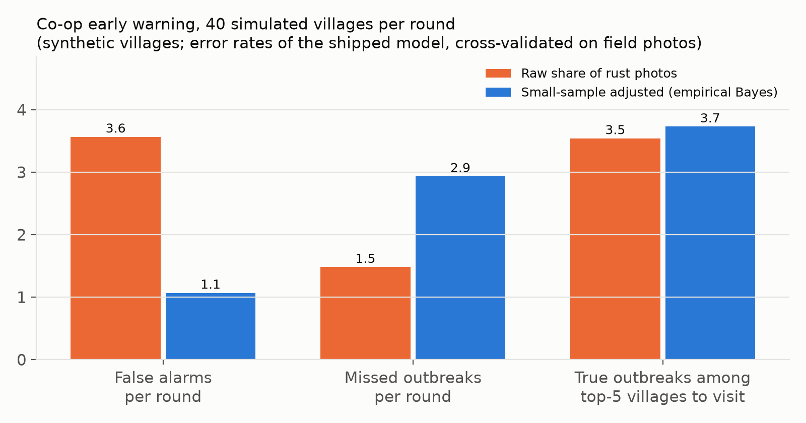

<!--
Generated from docs/templates/README.tmpl.md by ml/fill_docs.py (numbers come from results/numbers.json).
-->

# Majani Relay

**Standard leaf checks by cooperative relay farmers in central Kenya, turned into rust counts for the extension officer. Offline, in Swahili. It says "not sure" when it should, sends other problems to the officer, and the officer makes the final call.**

*Majani* is Swahili for "leaves"; say it **mah-JAH-nee**. Earlier versions were called Kahawa Check (*kahawa* = coffee). Like all our Swahili, the name still needs a check by a native speaker.

Live app: https://git-lsd.github.io/majani-relay/ · Code: https://github.com/git-lsd/majani-relay · Videos: Demo, Tech and Team videos are in the hackathon submission and will be added here after judging.

Officer and Co-op tabs: demo PIN **2026** (one fixed demo PIN, the same on every phone; see [Run it](#run-it)).

Built for the World Bank / Hack-Nation "Small AI for Development" hackathon, Agriculture sector, 3–4 October 2026.

---

## What it is

Kenyan coffee farmers mostly recognise visible rust. What fails is getting standard field checks to the one officer who serves thousands of farmers, early enough to change where that officer goes and when action starts.

Majani Relay is a phone web app that turns each relay farmer's plot visit into a standard record, keyed to the cooperative member (grower) number. A relay farmer is a farmer the cooperative trains to visit other members' plots. On each visit the relay farmer photographs the underside of 3 leaves on each of 5 coffee trees. A small image model on the phone labels each photo (healthy, leaf rust, leaf miner, brown eye spot (Cercospora) or Phoma), or sends it to the officer with **"not sure — the officer will look"**, so 15 photos become a rust count without the officer looking at every one. Unclear photos wait on the phone for a named officer, whose labels update the model on the phone; the update can be shared with other relay farmers as a small file. Village rust shares, adjusted for small numbers of photos, rank where the officer should go first. This works like the brief's own cotton example (Wadhwani AI), which counts pests to decide whether and when to act. A six-question checklist covers causes a leaf photo cannot show; the AI does not use its answers. Everything runs on the phone, without internet, after the first visit.

For the people using it: every result has a **"What does this mean?"** button that opens a short fixed guide (what it looks like, common causes, what to do now, when to call the officer), in English and Swahili. If the relay farmer disagrees with an answer, **"I think it's something else"** sends the photo to the officer, and it stays out of the village counts until the officer decides. Three optional taps record the farm's **variety, last spray and fruit load** for the officer; the AI does not use them.

**What we show, in four lines** (details in [Evaluation](#evaluation)):
- **A field-validated model.** On leaf photos taken on the plant with a smartphone, which it did not train on, it answers 91% and is right on 89% of its answers (5-fold cross-validation, Ecuador field photos).
- **It knows when it is unsure, and sends other problems to the officer.** On farm photos from Uganda, a new country it never trained on, it would be right on only 43% if forced to answer; instead it sends 93% to the officer. Photos of a pest outside its five answers (red spider mite) go to the officer 38% of the time before any officer labels, against 14% for our earlier model without an "other problem" answer.
- **It learns from the local officer, on the phone, and then answers more.** On the Ugandan photos, 50 officer labels raise "right if forced" from 43% to 81%. After 100 labels the app answers 46% of Ugandan photos and is right on 94% of those answers (scored on photos never used to choose any setting), so the officer labels fewer photos by hand as it learns.
- **It turns relay-farmer visits into rust counts and a careful village ranking.** In a simulation at the model's measured error rates, the small-sample adjustment cuts false alarms from 3.4 to 1.0 per 40 villages, at the cost of more misses near the alert line (1.6 to 3.0).

**Which decision from the brief.** The brief's list includes "documenting a field observation" and "connecting evidence to a pricing, market or extension-service next step". Majani Relay does both (the extension-service part), plus a third item on the list, identifying a crop problem, as far as a leaf photo can show it.

## Who uses it, and when

| Person | When | What they do with it |
|---|---|---|
| **Relay farmer** (cooperative volunteer, own smartphone) | During a plot visit, about 15 minutes per plot (our estimate; not timed on a farm) | Asks consent, enters the member number, takes 15 leaf photos, reads or plays the result and its "What does this mean?" guide to the farmer, taps "I think it's something else" when they disagree with an answer, records three optional farm details (variety, last spray, fruit load), asks the checklist, saves. Exports village totals for the cooperative. |
| **Extension officer or cooperative agronomist** (the named reviewer) | When they meet the relay farmer (the brief's scenario says the officer visits about twice a year), and when planning visits | Reviews the "not sure" queue, the photos the relay farmer disagreed with, and a 1-in-10 spot check on the relay farmer's phone; labels photos (including "Different problem (not in list)"); presses "Update the model on this phone"; shares the update. Sees the farm details next to each queued photo and can export plot records (CSV). Uses the village ranking to choose where to go first. |
| **Cooperative office** | When planning the officer's visits | Keeps the member list. Collects each relay farmer's village totals (CSV) and combines them; today this is done by hand. |
| **Noor** (smallholder, basic phone) | During the visit, on her own plot | Hears the result in Swahili (a few phrases in Kikuyu). Her own phone is not needed. |

Why the relay farmer and not Noor: only 27.5% of rural Kenyan women aged 15–49 own a smartphone (Kenya DHS 2022). Noor's phone stays at the house while she works. The cooperative already exists (cooperatives produce 70% of Kenya's coffee), and the World Bank-funded NAVCDP project already uses 3,248 "digitally equipped agripreneurs" for last-mile advice. Sources: [docs/PROBLEM_EVIDENCE.md](docs/PROBLEM_EVIDENCE.md).

## The problem

What the evidence says (every source, country, year and link: [docs/NEED_EVIDENCE.md](docs/NEED_EVIDENCE.md)):

- **Farmers mostly recognise visible rust, by their own report.** 83.8% of Ugandan farmers knew leaf rust (2016). A 2018 project covering Kenya, Uganda, Rwanda, Zimbabwe and India says most smallholders could recognise rust but many lacked the knowledge to manage it. No study we found tests how accurately coffee farmers name leaf problems, in any country.
- **The hard parts are elsewhere.** Early rust is pale spots before the orange powder appears. People judging rust severity by eye were off by up to 38% (Brazil, 2011). Acting in time fails too: in the Uganda study, rust cut Arabica income by 49.5% and only 20.8% of farmers sprayed.
- **The officer is stretched, and field information arrives late.** Kenya has one public extension agent per 1,380 farmers (target 1:600). The Ministry's 2026 draft data policy says one officer "typically serves 1,500–3,000 farmers" and that paper reporting has caused "delayed information flows". Kenya's 2024 coffee strategy says coffee-specific extension has "collapsed" in places.
- **Central America's answer after its 2012–13 rust crisis** was routine plot surveillance with alerts to field technicians (for example, Colombia inspects more than 4,500 plots four times a year). Those losses had many causes, and no study shows that phone surveillance cut rust losses.

**Problem statement** (the brief's template):

> Because of this tool, the county extension officer or cooperative agronomist will send their next visits to the villages with the most leaf rust, by the week the relay farmers' plot checks reach the cooperative, that they would otherwise do late, after paper reports arrive; we know because one Kenyan extension officer typically serves 1,500–3,000 farmers and paper-based reporting has caused "delayed information flows" (Ministry of Agriculture draft data policy, 2026), and coffee-specific extension has "collapsed" in places (Coffee Development and Marketing Strategy, 2024).

Simplifications: the evidence shows the gap is real; it does not show that this tool closes it, which needs a field pilot ([docs/PILOT_PLAN.md](docs/PILOT_PLAN.md)). "The week the checks reach the cooperative" depends on how often relay farmers export their totals.

## How it works

```
 Plot visit (relay farmer's phone, offline)
 ------------------------------------------
 consent --> village + member number (saved only as a scrambled code)
    |
    v
 leaf photo --> photo quality check (too dark, too bright, no detail -> "take again")
    |
    v
 frozen image model (MobileNetV3, 16.8 MB) --> 1,280 numbers per photo
    |
    +--> small head (82 KB) --> scores for 5 leaf answers + "other problem", and a confidence
    |
    +--> familiarity check: compare with 1400 stored training photos (1798 KB)
    |
    v
 Gate: confidence below the line, OR photo unlike the stored photos, OR "other problem" on top?
    |                                   |
   yes                                  no
    |                                   |
    v                                   v
 "Not sure - the officer will look"   answer from a FIXED list (English / Swahili / Kikuyu tier)
 photo goes to the officer queue      "The extension officer makes the final call."
 and stays out of the rust count      (1 in 10 answers also go to the queue as a spot check)
    |                                 "I think it's something else" --> officer queue, out of the count
    |                                 until the officer decides
    |
 "What does this mean?" on every result --> fixed guide: looks like / causes / do now / call the officer
    |
    v
 15 photos --> plot card  +  6-question checklist (not AI)  +  3 optional farm taps for the officer
              (variety, last spray, fruit load; the AI does not use them)  -->  saved on the phone

 Officer visit (same phone, offline)
 -----------------------------------
 officer labels queued photos --> small head refit on the phone, pulled toward the shipped model
   (5 answers, "Different problem",  --> labelled photos join the "familiar" set
    or "Skip")                       --> update file shared by WhatsApp / Bluetooth / memory card

 Co-op screen (offline)
 ----------------------
 rust share per village, shrunk toward the average of all villages (Beta-binomial, empirical Bayes)
 --> ranked list of villages for the officer's next visits
```

The model on the phone (head v3-2026-10-03-lab+field+other) was trained on 7045 lab-style photos from Kenya and Brazil plus 1303 field photos of healthy and rust leaves from Ecuador, and 154 photos of a pest (red spider mite) as "other problem". The "other problem" answer is never shown as a diagnosis: the photo goes to the officer with the reason "looks like a different problem", and it never counts as rust.

## The Small-AI rules and how we meet them

| Rule from the brief | How Majani Relay meets it | Limit, stated, and the next step |
|---|---|---|
| Runs on a device the user already has | The relay farmer's own smartphone, in the browser (iPhone or Android). No app store, no account, no server. | Tested in a desktop browser at phone size (375 × 812) and in headless Chrome; tried on one iPhone over local Wi-Fi (screens and audio). **Next step:** the team runs the full visit on a low-cost Android phone and an iPhone in airplane mode and times it (median seconds from photo to answer, first-load time), before the pilot starts. |
| Core feature works offline | After the first visit, a service worker keeps every file on the phone. Photo check, plot card, checklist, officer review, model update and co-op screen all work in airplane mode. | Tested with Chrome's offline mode, including under a sub-path as on GitHub Pages; not yet in airplane mode on a real phone (same next step as above). |
| Model files small enough to side-load or send over a weak connection | Image model 16.8 MB; head 82 KB; familiarity set 1798 KB. An officer's update holds the refitted head plus 1284 bytes per labelled photo in binary form (the app writes it as text, which is larger). | The first visit downloads about 36 MB once (model, runtime, Swahili audio), best done on cooperative Wi-Fi. The image model is not quantised (32-bit numbers). **Next step:** the ML lead tests 8-bit quantisation; kept only if the answers on the field photos match the full model; after the challenge. |
| At least one interaction in a named local language | **Swahili**: all 24 fixed answers as text and audio. **Kikuyu** (Gĩkũyũ), the less-supported tier: 3 answers start with a Kikuyu phrase, the rest falls back to Swahili, and the app says so. | No native speaker has checked the text yet; every local-language string is marked "not yet checked" on screen. **Next step:** a Swahili-speaking extension officer reviews all 24 answers in pilot week 1 (30 minutes; [docs/LANGUAGE.md](docs/LANGUAGE.md)). |
| A person makes the final call; flag what it is unsure of | Three routes to the officer ("not sure", "unfamiliar photo", "looks like a different problem"), plus a fourth for people: the relay farmer can tap "I think it's something else"; officer queue; 1-in-10 spot check; "Different problem (not in list)" label for the officer; every disease answer ends with "The extension officer makes the final call"; no spray names or doses; nothing is sent automatically. | The officer visits rarely, so a queued photo can wait a long time. The "not sure" answer says "Do not spray because of this result". **Next step:** agree a review rhythm with the cooperative (for example monthly) and measure queue waiting time in the pilot. |
| Avoid hallucinations | The tool never writes text. Every sentence comes from a fixed list of 24 answers in `answers.json` or from 6 fixed guides in `guides.json`. | The tool cannot answer free questions. Those go to the officer. A chat assistant that answers only from an officer-approved library is a roadmap item, not built ([Roadmap](#roadmap-not-built)). **Next step:** in the pilot the officer notes the free questions relay farmers bring (count by topic, weeks 3–8), to decide whether the fixed list needs more answers. |

## What the AI does, and why a simpler tool would not do the same job

- **It turns photos into counts.** It labels each leaf photo, or sends it to the officer. That makes 15 photos per plot into a rust count the cooperative can add up, without the officer looking at every photo. SMS cannot carry or read a photo. A spreadsheet cannot look at a leaf. A web search needs signal and returns general pictures, not a label for this leaf.
- **It knows when it does not know.** The familiarity check compares each photo with stored training photos; the "other problem" answer catches photos that look like a problem outside the list.
- **It learns from local labels on the phone.** The officer's labels refit the last layer of the model on the phone. No server and no data scientist are needed.
- **What is not AI.** The six-question checklist is fixed questions, and the app says the AI does not use the answers. The village ranking is plain statistics (a Beta-binomial model). The plot card rule is a fixed rule.

**Why not a paper tally sheet or a plain digital form?** A form can carry a count that a person writes down. What the AI step adds:
- the same labelling rule on every phone, across many relay farmers, instead of each person's own judgement;
- separating rust from look-alikes (leaf miner, brown eye spot, Phoma);
- a route for unclear leaves and other problems to the officer, instead of into the count as a guess;
- the photo is kept (as a small copy), so the officer can check any label later.

**Human baseline (one-evening test).** Two team members with no coffee knowledge, standing in for newly trained relay farmers, labelled the same 60 field photos with only a picture card. They told sick leaves from healthy ones well (91%–97% of answers) but named rust on only 5–7 of the 30 rust photos, often choosing "brown eye spot". The shipped AI, which never trained on these photos, answered 50 of the 60 (88% right), named rust on 19 of the 30 and called 4 of the 30 healthy leaves a problem. So a card is enough to notice that something is wrong; the AI adds a consistent rust label, which is what a village count needs. Limits: two non-experts, one dataset (Ecuador robusta), and the AI had trained on other field photos from the same dataset while the people had only lab-style card pictures. **Next step:** repeat the card test with relay farmers trained by the cooperative, on 60 officer-labelled Kenyan pilot photos, in the first pilot month ([docs/PILOT_PLAN.md](docs/PILOT_PLAN.md)). We have not shown that the AI gives better counts than a trained relay farmer with a tally sheet.

## Prior art

Much of this exists already, and we build on it. Coffee leaf photo apps exist in East Africa: PlantVillage Nuru (now PlantVillage+) has had a coffee rust model in Uganda since 2022, and KawaScan works offline in Uganda. Coffee rust surveillance with standard plot counts and regional alerts has run in Central America, Mexico and Colombia since 2013–2014, with counts by eye and no image AI. Saying "not sure" is published (Digital Green's FarmerChat rejects poor photos; Pham et al. 2025 reject low-confidence coffee predictions), and the drop from lab photos to field photos has been reported before (Xiang et al. 2026; Zuñiga Cajas et al. 2025 on the same Ecuador dataset). What we did not find in our searches (3 Oct 2026), for coffee or in any extension tool: standard plot photos from a relay farmer turned into rust counts, with unclear photos queued for a named officer, the officer's labels updating the model on the phone, and villages ranked for visits with a small-sample adjustment. Each part has a precedent elsewhere; the combination is what we claim, and we say "not found", never "first". Tools, programmes, datasets, sources and search limits: [docs/PRIOR_ART.md](docs/PRIOR_ART.md).

## Fit with the farmer registry

The brief warns that AI built where there is no farmer registry will be hard to use. In Kenyan coffee this precondition is **partly met**: the national registry (KIAMIS) exists but is incomplete and its contact details are not kept up to date, while cooperative member lists, keyed by member (grower) number, are what reliably reaches coffee farmers today (they were used to pay hundreds of thousands of farmers). We do not build or fix a registry; we plug into the cooperative list. Kenya has over 800,000 smallholder coffee farmers, and about 550 cooperatives market over 80% of the coffee ([docs/PROBLEM_EVIDENCE.md](docs/PROBLEM_EVIDENCE.md), rows 4 and 6).

- **How it fits.** Each plot record is keyed to the member number, stored on the phone as a scrambled code. Today that links visits to the same farm on the phone; exports hold village totals only. A later version could link records to the cooperative's list and to KIAMIS, the national farmer registry, through the same number. We have not built that link.
- **What the tool assumes exists:**
  - a cooperative member list, and a cooperative active enough to support a relay farmer (in the brief, Noor is a member for 11 years yet sells her parchment to a passing middleman, which suggests her cooperative is weak at marketing; our tool needs its list and its relay farmers, not its marketing);
  - a relay farmer with a smartphone;
  - a named person who answers the officer queue: the county extension officer, or the cooperative's agronomist or field officer.
- **If nobody answers the queue:** the photos stay queued, the plot card says "waiting for the officer", and the advice stays "Do not spray because of this result". The model does not adapt, and the village ranking rests on fewer photos.
- **Who is left out:** farmers outside cooperatives; and, if records are later linked to plot maps, land that is not yet mapped (about 30% of coffee land was geo-mapped in July 2025). Sources: [docs/NEED_EVIDENCE.md](docs/NEED_EVIDENCE.md), section 5.

## Data

All five image datasets are open under **CC BY 4.0**. None was collected by us. Full details, including what each dataset does not cover: [docs/DATA_CARD.md](docs/DATA_CARD.md).

| Role | Dataset | Notes |
|---|---|---|
| Train (lab-style) | JMuBEN + JMuBEN2 (Kenya, Kirinyaga, arabica) | Cropped close-ups with many rotated copies; up to 1,500 per class after removing copies |
| Train (half) and calibrate (other half) | BRACOL (Brazil, arabica) | Picked leaves on a white background; our download was damaged, 1,342 of 1,747 leaf images usable |
| Field training, tested by 5-fold cross-validation | RoCoLe (Ecuador, robusta) | Leaves on the plant, one smartphone, real light. Healthy and rust; red spider mite photos train the "other problem" answer. The 60 picture-card photos and the 7 demo photos are never trained on |
| External test, never trained on | Uganda coffee leaf dataset (Soroti University) | Close-ups of leaves on farms in Uganda; healthy, rust, Phoma. 3,192 photos, grouped into 1,351 distinct leaves because the set mixes in rotated and flipped copies |
| Demo photos | 7 RoCoLe photos in `samples/` | Never trained on |

The shipped model trains on 8502 photos (7045 lab-style, 1303 field, 154 mite as "other"). Calibration uses 672 lab-style photos plus out-of-fold field predictions.

**What the data does not cover.** No photo comes from a Kenyan farm taken the way the tool will be used: the Kenyan photos are lab-style crops, the field training photos are from Ecuador (robusta), and the external test is from Uganda (species not stated). Only five leaf classes, plus one pest as "other". No berries (so no coffee berry disease or berry borer: the checklist covers these). No relay farmers' phones. Each gap has a next step in [Limitations](#limitations).

## Evaluation

Full results: [results/RESULTS.md](results/RESULTS.md). Figures: `results/figs/`. Every number below is generated from `results/metrics.json` and `results/uganda_external.json`.

**1. The shipped model on field photos (5-fold cross-validation, Ecuador field photos it did not train on).**

| Healthy and rust leaves on the plant | Shipped model |
|---|---|
| Photos answered (the rest go to the officer) | 91% (sd 0.8 points) |
| Answers that are correct | 89% (sd 2.5) |
| Rust leaves named rust | 72% (sd 4.1) |
| Healthy leaves called a problem | 6% (sd 3.1) |
| Correct if forced to answer every photo | 87% |
| Calibration error (0 = confidence matches accuracy) | 0.04 |

On the photos it sends to the officer it would have been right only 63% of the time, so the officer gets the hard ones. On 60 photos kept out from the start (the picture-card photos) it answers 50 of 60, 88% correctly. Lab-style photos still work: 84% right on held-out BRACOL photos.



**2. Other problems go to the officer.** The model has an "other problem" answer, learned from 154 red-spider-mite photos. Scored on mite photos it never saw: 38% go to the officer (our earlier model without "other": 14%), and 85 of 167 are counted as rust (earlier model: 121). In the dataset's own mix of healthy, rust and mite photos, mite photos make up 15% of the "rust" answers (earlier model: 20%). The cost: 2.2% of rust leaves now wait for the officer as "other", and rust leaves named rust go from 76% to 72% (lower in 5 of 5 folds).



**3. A new country: farm photos from Uganda, never trained on.** 3,192 photos (1,351 distinct leaves; each counts once).

| Ugandan photos | Shipped model |
|---|---|
| Sent to the officer (mostly "looks unfamiliar") | 93% |
| Right if forced to answer every photo | 43% |
| Answers that are correct (of the 7% answered) | 52% (95% interval 41–62%) |
| Healthy leaves called a problem | 3% |

The "not sure" check does its job in a new country: forced, the model would be wrong more often than right, so the app sends almost every photo to the officer instead of guessing. Then the officer's labels teach it, and the app starts answering (dataset labels stand in for the officer; mean of 5 random splits and label orders):

| Officer labels | 0 | 10 | 20 | 50 | 100 |
|---|---|---|---|---|---|
| Photos answered | 7% | 14% | 19% | **32%** | **46%** |
| Answers that are correct | 53% | 80% | 85% | **92%** | **94%** |
| Right if forced to answer every photo | 43% | 68% | 72% | 81% | 85% |

Two things happen on the phone. The model is refit on the officer's labels, so it learns the new country ("right if forced"). And the labelled photos open the "not sure" gate: a photo also counts as familiar when its single nearest officer-labelled photo is close (cutoff 0.494, `ood.local_nearest_cutoff` in `model/head.json`). That cutoff was chosen, by a rule written down before the first run, on 40% of the Ugandan copy groups; the first two rows are scored on the other 805 copy groups only. "Right if forced" does not depend on the cutoff, so it is shown on all Ugandan photos.

Before this check, the app answered only 10% of Ugandan photos after 100 labels (91% correct), because the varied Ugandan photos rarely have 10 close stored photos. The cost of the new check: healthy leaves called a problem rise from 0.7% to 1.6% after 100 labels. Checks set in advance on other photos passed: in the Ecuador new-region simulation answers stay as accurate (82% → 82% correct after 50 labels) while more are answered (91% → 93%); mite photos sent to the officer drop by at most 1.7 points (limit set in advance: 5); the decisions on the 60 picture-card photos are identical. What it does on Kenyan photos is a pilot test (next step in [Limitations](#limitations)).



**4. People with a picture card vs the AI.** See the human baseline above. 

**5. Village ranking (simulation with synthetic villages, at the shipped model's measured error rates).** Per round of 40 villages with about 6.6 real outbreaks: raw shares raise 3.4 false alarms and miss 1.6 outbreaks; adjusted shares raise 1.0 false alarms and miss 3.0. If the officer can visit 5 villages, the adjusted ranking finds 3.7 real outbreaks against 3.5 for raw shares. The adjustment trades fewer false alarms for more misses near the line; missed villages still appear in the ranked list, below the alert line. The app and the simulation use the same rule: alert when the chance that a village's rust share is above 25% is more than 0.5. The villages are synthetic; only the model's error rates are measured.



**6. Why we train on field photos and keep the "not sure" check.** Our first model, trained on lab photos only, was right on only 2.5% of the Ecuador field photos while 93% confident on average; its confidence gave no warning, while the familiarity check caught almost every field photo (AUROC 0.999). That result is why the shipped model trains on field photos and keeps the check. Starting from that lab-only model and treating the Ecuador photos as a new region, 50 officer labels let it answer 93% of photos, 82% correctly ([results/RESULTS.md](results/RESULTS.md), section 3.6).

**7. Size vs accuracy.** A 5 times larger image model (DINOv2-small, about 87 MB) is right 49% of the time on field photos with no field training. Training the small model on field photos does better (87% forced, cross-validated), so we ship the 16.8 MB model that fits the side-loading rule.

**Speed.** About 4 ms per photo on a laptop CPU. The app shows the time on the phone under "Details" after each photo; we have not yet recorded it on a phone.

**The phone matches the Python pipeline.** The ONNX model and the shipped head give the same class as the Python evaluation on 25/25 test photos, and the same decision on all 7 demo photos.

## Responsible AI

Summary below. The full account (privacy, consent, deletion, Kenya Data Protection Act, bias, failure modes): [docs/RESPONSIBLE_AI.md](docs/RESPONSIBLE_AI.md).

- **Fail-safe:** "not sure — the officer will look" whenever the model is unsure, the photo is unfamiliar, or it looks like a different problem.
- **Who answers the queue:** a named county extension officer or cooperative agronomist. If nobody does, photos wait and the advice stays "Do not spray because of this result".
- **Human oversight:** the officer makes the final call. The relay farmer can disagree with any answer ("I think it's something else"); the photo then waits for the officer and stays out of the village counts until the officer decides. Only officer labels change the model. A penalty keeps updates close to the shipped model. An update loads only on the model version it was made for.
- **No advice that can hurt:** no pesticide names, no doses, no prices. Fixed answers only.
- **Privacy:** no names, phone numbers or locations. The member number is saved only as a SHA-256 code (short numbers can still be guessed by someone with the phone). Photos are kept as 160-pixel thumbnails. Data stays on the phone until a person exports it. The co-op export holds village totals only. The plot-records export, for the officer, holds one row per plot (village, date, counts, farm details, checklist) without member numbers, member codes or photos. The model update file holds no photos, villages or member codes.
- **Consent:** asked aloud at the start of every visit. The visit cannot start without it.
- **Officer screens:** the Officer and Co-op tabs open only after the officer PIN. Demo simplification: one fixed PIN (2026), the same on every phone, checked on the phone and unlocked until the app is reloaded. It keeps these screens out of casual reach; it is not real security.
- **Deletion:** "Delete all data on this phone" in the About screen; "Discard this visit" for an unfinished visit.
- **Known gaps, each with a next step in [docs/RESPONSIBLE_AI.md](docs/RESPONSIBLE_AI.md):** no per-farm delete button; only a fixed demo officer PIN, not one each officer sets, and no PIN on the plot-visit records; no native-speaker check yet.

## Languages

English on screen. Swahili for the 24 fixed answers, as text and audio. Kikuyu as the less-supported tier. Details, resource comparison and the native-speaker review plan: [docs/LANGUAGE.md](docs/LANGUAGE.md).

| | Swahili | Kikuyu |
|---|---|---|
| Common Voice speech hours | 417 validated | 0 (not open for recording) |
| Machine translation from English (NLLB-600M, chrF++) | 58.0 | 34.9 |
| Text-to-speech voice | Meta MMS | Meta MMS |
| In the app | All 24 answers, text and audio | 3 answers start with a Kikuyu phrase; the rest is Swahili, marked as fallback |

No one on the team speaks Swahili or Kikuyu. So the tool uses a fixed list a speaker can check in about 30 minutes, and every local-language string is marked unverified until then. Without a speaker, we cross-checked every phrase four ways (two translation models, a blind back-translation by a separate AI agent, and key terms against published Swahili farm material) and rewrote 10 weak phrases ([docs/SWAHILI_CHECK.md](docs/SWAHILI_CHECK.md)). Under every Swahili or Kikuyu sentence, a **"Wording wrong?"** button lets the relay farmer or officer report a better phrasing; reports are saved on the phone, travel with the officer's update or as a CSV, and never change the app's text until someone reviews them. English sentences have no such button, because the English is the team's own source text. On the English screen, the play button plays the Swahili audio (tagged "Audio in Swahili"). The 6 "What does this mean?" guides have the same tags and the same "Wording wrong?" button on each Swahili or Kikuyu section; their Swahili was checked by machine back-translation only (20 of 24 sections read back correctly, 4 flagged for a speaker; [docs/GUIDES.md](docs/GUIDES.md)).

## Run it

**On a phone (GitHub Pages).** Open https://git-lsd.github.io/majani-relay/ once with internet. The chip at the top right shows "Saving for offline", then "Model ready". From then on it works in airplane mode. Use "Add to Home Screen" from the browser menu so it opens like an app (on iPhone this also stops Safari from clearing its data after 7 days without use).

**Locally.** The app is plain HTML, CSS and JavaScript, with no build step. It needs a local web server, because browsers block the model and the offline cache on `file://` pages.

```bash
cd majani-relay    # the folder you cloned or downloaded
python3 -m http.server 8000
# open http://localhost:8000 in Chrome, at phone width (DevTools device toolbar)
```

To try it (**Officer and Co-op tabs: demo PIN 2026**; once typed, both tabs stay open until the app is reloaded):
1. **Plot visit** → "Farmer agrees" → type any village → "Try sample photos". The healthy samples come back "Healthy", rust levels 1 and 2 "Leaf rust", and rust level 3 "Not sure" (the photo looks unfamiliar). The red spider mite sample is wrongly answered "Healthy": a stated limit, caught only if the 1-in-10 spot check picks it.
2. On the rust level 1 result, tap **"What does this mean?"** to read the rust guide. Tap **"I think it's something else"** → "Yes, send": the photo joins the officer queue and leaves the counts ("Undo" brings it back). On the plot summary, try the three farm taps (variety, last spray, fruit load).
3. **Officer** → type the demo PIN 2026 → the rust level 3 photo waits in the queue. Tap "Leaf rust", then "Update the model on this phone". Try rust level 3 again: it is now answered, because the labelled photo joined the familiar set (this shows how the update works; it is not a test).
4. **Co-op** → "Load demo villages (synthetic)" shows the ranking. Do this in a fresh browser to see the intended example (Demo village A, 2 rust photos of 3, below the alert line): a saved visit with rust photos raises the average all villages are pulled toward, and then Demo village A also alerts.

Note: offline mode on a phone needs HTTPS. A phone opening `http://<laptop-ip>:8000` on the same Wi-Fi can test the screens, but not offline mode. Use the GitHub Pages address for that.

**Publish on GitHub Pages.** Upload the contents of this folder to a public repository. Then Settings → Pages → "Deploy from a branch" → `main`, `/ (root)` → Save. After a minute or two the app is at `https://<user>.github.io/<repo>/`. Add an empty file called `.nojekyll` at the top level so GitHub serves every file as it is. **On every new deploy, change `VERSION` in `sw.js`**, or phones keep the old model and audio.

**Rebuild the model and every number** (optional; needs the raw datasets, about 2.7 GB, in `../data_raw/`; download links in [docs/DATA_CARD.md](docs/DATA_CARD.md)). With a Python environment that has PyTorch, timm, onnxruntime, scikit-learn, scipy and Pillow:

```bash
python ml/prepare_embed.py      # index datasets, remove augmented copies, embed photos
python ml/train_eval.py         # shipped head, cross-validation, lab-only simulation, village simulation
python ml/check_onnx.py         # check the phone's model gives the same answers as Python
python ml/score_baseline.py     # picture-card photos: people vs the AI
python ml/eval_uganda.py        # Ugandan external test and learning loop (add --download on a fresh machine)
python ml/eval_familiarity_rule.py  # nearest-officer-photo check: cutoff chosen on 40% of the Ugandan copy groups, tested on the rest
python ml/make_figures.py       # figures in results/figs/
python ml/write_results_md.py   # results/RESULTS.md and results/numbers.json
python ml/fill_docs.py          # fills the numbers in this README and the docs (templates kept by the team, not in this repo)
```

The Swahili and Kikuyu texts and audio are rebuilt with the scripts in `audio/tools/` (see [docs/LANGUAGE.md](docs/LANGUAGE.md), section 8).

## What is in this repository

| Path | What it is |
|---|---|
| `index.html`, `app.js`, `styles.css` | The app (no framework, no build step) |
| `sw.js`, `manifest.webmanifest`, `icons/` | Offline cache and "Add to Home Screen" |
| `lib/kahawa-core.js` | Shared maths: familiarity check, on-phone refit, Beta-binomial prior |
| `vendor/ort/` | onnxruntime-web 1.30.0 (WebAssembly build) and its licence |
| `fonts/` | Fraunces and IBM Plex Sans web fonts (self-hosted so the app works offline) and their licences |
| `model/` | Image model (ONNX), shipped head and familiarity set; the lab-only head, its familiarity set and a 50-label update (`*_labonly*`), used for the new-region simulation and the starter kit, not by the app |
| `answers.json`, `audio/` | The fixed answer list (English, Swahili, Kikuyu tier) and audio |
| `guides.json` | The fixed "What does this mean?" guides, with sources ([docs/GUIDES.md](docs/GUIDES.md)) |
| `samples/` | 7 RoCoLe field photos for the demo |
| `ml/` | Training and evaluation scripts |
| `results/` | Metrics, figures, RESULTS.md |
| `docs/` | Data card, Responsible AI, pilot plan, officer decision context, result guides, prior art, languages, problem evidence, need evidence, video scripts |

## Licences and attributions

| Item | Licence | Credit |
|---|---|---|
| JMuBEN, JMuBEN2 | CC BY 4.0 | Jepkoech, Mugo, Kenduiywo, Chebet (2021); University of Embu, JKUAT, Chuka University. *Data in Brief* 36, 107142 |
| BRACOL | CC BY 4.0 | Krohling, Esgario, Ventura (2019); Universidade Federal do Espírito Santo |
| RoCoLe (including the 7 photos in `samples/`) | CC BY 4.0 | Parraga-Alava, Cusme, Loor, Santander (2019). *Data in Brief* 25, 104414 |
| Uganda coffee leaf dataset ("A Machine Learning Dataset for Classification of Common Coffee Leaf Diseases in Uganda") | CC BY 4.0 | Soroti University (Uganda), Mendeley Data, 2025, doi 10.17632/k36wnd6knb.1. Used as a test set only; no Ugandan photo is in this repository |
| MobileNetV3-Large weights (timm `mobilenetv3_large_100`) | Apache-2.0 | Ross Wightman, PyTorch Image Models. Pretrained on ImageNet-1k, whose images have their own non-commercial terms; we use the released weights and share no ImageNet images. |
| onnxruntime-web 1.30.0 | MIT | Microsoft. Licence in `vendor/ort/LICENSE.txt` |
| Fraunces, IBM Plex Sans (fonts) | SIL Open Font License 1.1 | Undercase Type; IBM. Licences in `fonts/` |
| Swahili and Kikuyu audio (made with Meta MMS TTS, `facebook/mms-tts-swh`, `facebook/mms-tts-kik`) | CC-BY-NC 4.0 | Meta AI. Non-commercial: fine for this hackathon and a non-commercial pilot. A paid service would need recorded human clips. |
| NLLB-200 and MMS-1b-all (used on a laptop to check text and audio; not shipped) | CC-BY-NC 4.0 | Meta AI |
| Advice text in `answers.json` | – | Written from Kenyan extension material, mainly the Kenya Coffee Sustainability Manual (review led by KALRO Coffee Research Institute), Infonet-Biovision and CABI Plantwise. Sources per answer in `answers.json`. |
| Our code and documents | MIT (see LICENSE) | The team |

## Limitations

Each limit has its next step: what, who, how we measure it, and when. Most of them are built into the 90-day pilot ([docs/PILOT_PLAN.md](docs/PILOT_PLAN.md)); the full list is in [results/RESULTS.md](results/RESULTS.md), section 3.8.

- **No Kenyan farm photos yet.** Field training photos are Ecuadorian robusta; the external test is Ugandan. **Next step:** keep the first 200 officer-labelled Kenyan pilot photos aside as a sealed Kenyan test set. Who: the team with the cooperative's extension officer. Metric: photos answered, answers correct, rust leaves named rust. When: first pilot month.
- **In a new region the officer still sees most photos at first.** On the Ugandan photos never used to choose a setting, the app answers 14% after 10 officer labels and 32% after 50 (Ecuador simulation: 93% after 50). The nearest-officer-photo check that opens it was chosen on Ugandan photos (a separate part) and checked on Ecuador and mite photos, not on Kenyan photos, and it roughly doubles healthy leaves called a problem (0.7% → 1.6% after 100 labels). **Next step:** report photos answered and answers correct on the sealed Kenyan pilot test, with the app rule and the previous rule side by side. Who: ML lead. Metric: answered and correct after 50 and 100 labels; healthy leaves called a problem must stay under 2%. When: first pilot month.
- **Phoma can reach the rust count.** In Uganda 9% of Phoma leaves are answered "rust"; forced, 53% would be. The shipped model has seen Phoma only in lab photos. **Next step:** train on half of the Ugandan copy groups (Phoma field photos included) and test on the other half. Who: ML lead. Metric: Phoma leaves answered "rust" and rust leaves named rust on the held-out half. When: before the pilot starts.
- **Officer labels of only healthy and rust photos wear down the "other" answer.** The 38% of mite photos sent to the officer holds before any officer labels. When the phone is updated with 10 officer labels of healthy and rust photos, the share falls to 26%, and to 13% after 100 (starting from 71% with no labels in this test, which is optimistic because the head trained on most of these photos). The cause is the on-phone refit, not the familiarity check. Until it is fixed, the 1-in-10 spot check and the officer's "Different problem" labels are the safeguard. **Next step:** keep the "other" weights fixed during the on-phone refit, or mix stored "other" photos into it, and rerun the mite test. Who: ML lead. Metric: mite photos sent to the officer after 10, 50 and 100 healthy and rust labels, within 5 points of the no-label level, with rust leaves named rust unchanged. When: before the pilot starts.
- **Mite photos still reach the rust count, and "other" knows one pest.** 85 of 167 mite photos are still answered "rust"; the demo's mite sample is answered "healthy". Brown eye spot in the field, other pests and nutrient shortage are not in "other". **Next step:** the officer labels every "Different problem" photo in the queue; the ML lead retrains "other" with them and keeps 1 in 5 aside as a test. Who: extension officer and ML lead. Metric: mite-like photos counted as rust (must fall), rust leaves named rust (must stay within 3 points). When: pilot week 4.
- **A few "Different problem" labels can swing the on-phone update.** On the 7 demo photos, an update built from a single "Different problem" label (and no healthy labels) sent the healthy demo photos to the officer as "looks like a different problem"; with a healthy and a rust label added, all demo photos came back as before. **Next step:** test the on-phone update with 1–20 labels that include "Different problem", and add a rule (for example, a stronger pull toward the shipped model for "other", or a minimum number of healthy and rust labels) if healthy photos are sent to "other". Who: ML lead. Metric: healthy field photos sent to "other" after the update (must stay near 0.4%). When: before the pilot starts.
- **No plant IDs in the Ecuador photos.** Leaves of one plant can sit in both a training and a test fold, so cross-validated numbers may be optimistic; the 60 picture-card photos give a second check. **Next step:** record plot and plant with every pilot photo so tests can hold out whole farms. Who: the team adds the fields; relay farmers fill them in. Metric: answers correct on held-out farms against randomly held-out photos. When: from the first pilot visit.
- **Labels come from dataset authors, not an officer.** **Next step:** the extension officer relabels 100 random Ecuador photos and 100 random Ugandan photos. Who: cooperative extension officer. Metric: share of photos where the officer agrees with the dataset label. When: pilot week 1.
- **The village ranking is a simulation** with synthetic villages; it ranks rust already seen and does not predict outbreaks. Each phone ranks only its own records; combining phones is done by hand. **Next step:** replay both alert rules on pilot visit data and compare with the officer's own village checks. Who: ML lead with the extension officer. Metric: false alarms and missed outbreaks. When: after 3 months of pilot visits.
- **Leaf photos only.** It misses coffee berry disease (berries), Kenya's most damaging coffee disease, and bacterial blight. The checklist (not AI) asks about berries, fertility, old trees, weeds and dry spells; the tool does not explain a yield drop. **Next step:** in the pilot, compare checklist "yes" answers on berry spots with the officer's own berry checks. Who: extension officer. Metric: share of officer-confirmed berry problems the checklist flagged. When: pilot weeks 3–8.
- **It needs a named reviewer.** Without one, queued photos wait, the model does not adapt, and the ranking rests on fewer photos. **Next step:** the cooperative names the reviewer before the pilot. Metric: median days a queued photo waits. When: pilot week 1.
- **Unverified Swahili and Kikuyu.** Back-translation flagged 10 of 24 Swahili answers for a speaker to check, and 4 of 24 guide sections. The Phoma guide rests mostly on Brazilian and general sources. Next step in the Small-AI table above; a KALRO coffee agronomist also checks the Phoma guide in pilot week 1.
- **Phones.** Tried on one iPhone over local Wi-Fi only; offline mode not yet tested on a phone; first download about 36 MB. The newest features (guides, "I think it's something else", farm details) were tested in a desktop browser whose storage ran in memory, so saving the guides for offline use and keeping disagreements and farm details across a reload are not yet tested. Next step in the Small-AI table above.
- **Privacy on a shared phone.** The Officer and Co-op tabs open only after a fixed demo officer PIN (2026). It is the same on every phone, checked on the phone and shown on the lock screen, so it keeps these screens out of casual reach but is not real security. The Plot visit tab has no PIN; there is no per-farm delete and no remote wipe; short member numbers can be guessed from their codes. **Next step:** add a per-farm delete button, a PIN each officer sets, and a PIN for the plot-visit records. Who: app lead. Metric: all three work offline on the test phones. When: before the pilot starts.
- **Who is left out.** Farmers outside cooperatives; farmers no relay farmer visits; land not yet mapped, if records are later linked to plot maps. **Next step:** in the pilot, the co-op manager counts members whose plots no relay farmer visited. When: pilot week 12.
- **Price is out of scope.** The brief also mentions price information; this tool stays on one decision: where the officer should look first, based on standard leaf checks. **Next step:** none in the pilot; at the week-12 review the co-op manager says whether price information should sit next to the visit record.
- **What we do not claim:** that farmers cannot tell when coffee is sick; that the tool finds rust earlier than people or before symptoms show; that it cuts losses or raises yield; that it beats extension officers or a paper form; that it predicts outbreaks. Full list: [docs/NEED_EVIDENCE.md](docs/NEED_EVIDENCE.md), section 6.

## Roadmap (not built)

- **Majani Relay Assistant.** A chat assistant for relay farmers that answers only from a vetted library of answers the officer has approved. It never generates free text: it picks an approved answer or says it does not know, and then sends the question to the officer. Not built. **Next step:** in the pilot the officer notes the free questions relay farmers bring (count by topic, weeks 3–8); the officer's answers to the most common ones become the library's first entries. Who: extension officer with the app lead. Metric: share of relay farmers' questions the library covers. When: after the pilot.
- **Officer decision context.** Next to each village's rust count, the officer screen will show what a photo cannot: where the village is in the rainy season and the KALRO Coffee Research Institute spray calendar, rainfall from CHIRPS (satellite rainfall estimates), and altitude. It will also summarise the three plot-visit taps that are already in the app: variety, last spray and fruit load. **The AI does not use these;** the photo model is unchanged. They inform the officer's decision and are not combined into a risk score. The variety, season and calendar points come from Kenyan sources (KALRO-CRI); the evidence on fruit load is from outside Kenya (Costa Rica, Honduras, Brazil, Hawaii), and the pilot records it to test whether it matters here. Sources and gaps: [docs/OFFICER_CONTEXT.md](docs/OFFICER_CONTEXT.md); pilot design: [docs/PILOT_PLAN.md](docs/PILOT_PLAN.md).
- **Getting records to the officer and the cooperative without hand work.** Today the queue lives on the relay farmer's phone and the cooperative combines CSV exports by hand. Sending the queue to the officer's own phone and combining phones are not built. **Next step:** in the pilot, combining stays by hand and the co-op manager records the time it takes. Who: co-op manager. Metric: hours a week spent combining the relay farmers' exports. When: pilot weeks 1–12; the week-12 review decides whether sending and combining are built next.

## Team

- **Sidian Lin**, PhD in Public Policy (Harvard GSAS and HKS). Works on operations research and machine learning for public services. Co-wrote a report on Zimbabwe's Friendship Bench (task-sharing in community mental health), and wrote a paper on steering patients to hospitals when hospital quality is estimated from few cases.
- **Yicong Li**, PhD student in Computer Science (Harvard), working on computer vision.

Built with an AI coding assistant (Claude Code). The team directed the design and is responsible for what is submitted.
